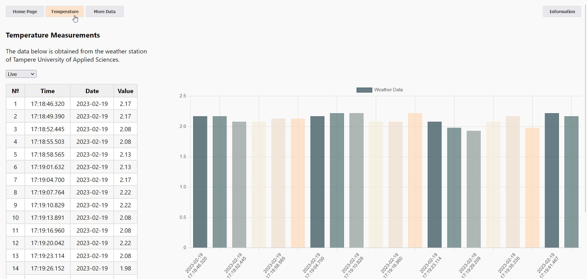

## Tampere Weather Forecast
The data is dynamically received from the Tampere University of Applied Sciences weather station and can be presented in various formats, such as tables and charts with configurable parameters.

Some of the data:
- Temperature
- Precipitation
- Light level
- Humidity level
- Wind speed and direction

## Preview

 For the proper operation of the web page, it is recommended to use the Mozilla Firefox browser.

  ## Backend API

- http://webapi19sa-1.course.tamk.cloud/v1/weather
- http://webapi19sa-1.course.tamk.cloud/v1/weather/temperature
- http://webapi19sa-1.course.tamk.cloud/v1/weather/rain
- http://webapi19sa-1.course.tamk.cloud/v1/weather/light
- http://webapi19sa-1.course.tamk.cloud/v1/weather/humidity_out
- http://webapi19sa-1.course.tamk.cloud/v1/weather/humidity_in

## Technologies used:
JavaScript, HTML, CSS
